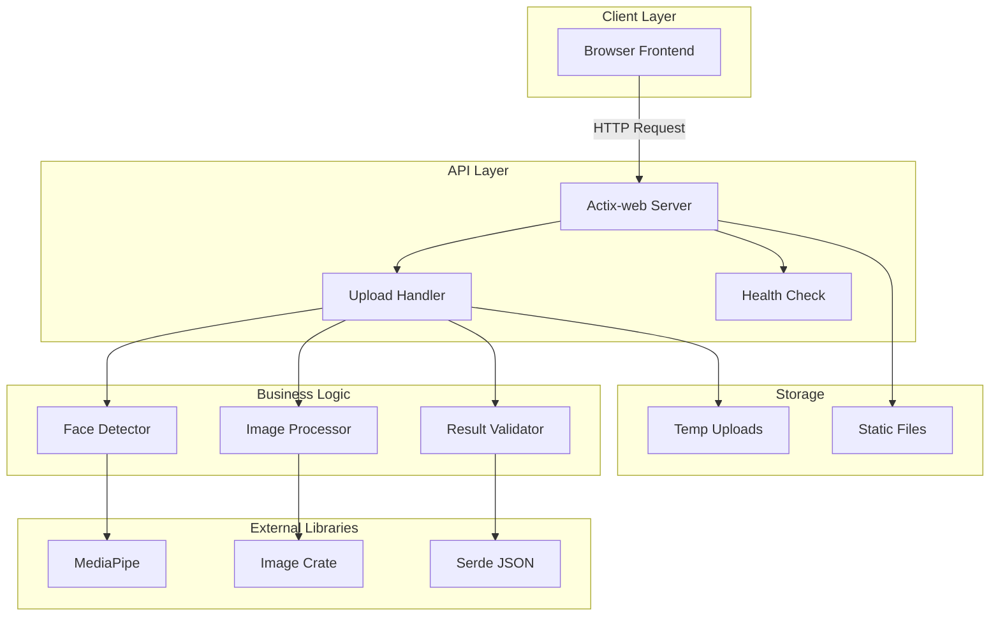
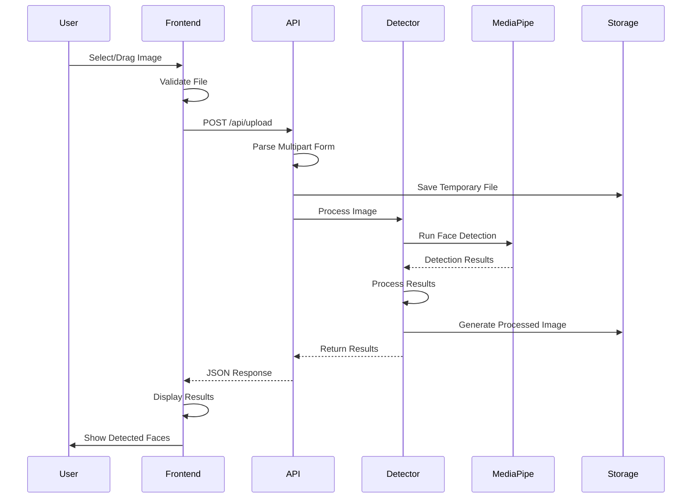

# Face Detection Rust

Aplikasi deteksi wajah menggunakan Rust dengan image processing, dilengkapi dengan API REST dan frontend web modern.

## 🎯 Fitur
- ✅ Upload gambar untuk deteksi wajah (drag & drop atau click)
- ✅ Deteksi multiple wajah dalam satu gambar
- ✅ Visualisasi hasil dengan bounding boxes dan confidence scores
- ✅ Crop wajah yang terdeteksi
- ✅ Download wajah yang tercrop
- ✅ Real-time processing dengan async Rust
- ✅ Modern UI dengan responsive design
- ✅ REST API untuk integrasi
- ✅ Error handling yang comprehensive

## 🏗️ Teknologi
- **Backend**: Rust dengan Actix-web
- **Image Processing**: image crate + imageproc
- **Async Runtime**: Tokio
- **Frontend**: HTML5, CSS3, Vanilla JavaScript
- **Face Detection**: Mock implementation (siap untuk integrasi OpenCV/MediaPipe)

## 📋 Prasyarat
- Rust 1.70+ (install dari [rustup.rs](https://rustup.rs))
- Cargo (termasuk dengan Rust)
- Node.js (opsional, untuk development frontend)

## 🚀 Instalasi & Setup

### 1. Clone Repository
```bash
git clone https://github.com/0xHadiRamdhani/rust-face-detect
cd rust-face-detect
```

### 2. Build Project
```bash
cargo build --release
```

### 3. Jalankan Server
```bash
cargo run
```

Server akan berjalan di `http://localhost:8080`

## 📖 Cara Penggunaan

### 1. Akses Web Interface
Buka browser dan aksa `http://localhost:8080`

### 2. Upload Gambar
- **Drag & Drop**: Tarik gambar ke area upload
- **Click to Upload**: Klik area upload dan pilih file
- **Format yang didukung**: JPG, JPEG, PNG (max 10MB)

### 3. Lihat Hasil
- Gambar asli dan hasil deteksi ditampilkan side-by-side
- Bounding boxes berwarna hijau menandai wajah yang terdeteksi
- Informasi detail untuk setiap wajah (posisi, ukuran, confidence)

### 4. Crop Wajah
- Klik tombol "Crop Face" pada setiap wajah untuk crop individual
- Klik tombol "Crop All Faces" untuk crop semua wajah sekaligus
- Download hasil crop sebagai file gambar

## 🔧 API Endpoints

### Upload Image
```http
POST /api/upload
Content-Type: multipart/form-data

Body:
- image: File (JPG/PNG, max 10MB)

Response: 200 OK
{
  "success": true,
  "data": {
    "original_image": "base64_encoded_string",
    "processed_image": "base64_encoded_string_with_boxes",
    "faces": [
      {
        "x": 100,
        "y": 150,
        "width": 80,
        "height": 80,
        "confidence": 0.95
      }
    ],
    "total_faces": 1,
    "processing_time_ms": 150
  }
}
```

### Crop Faces
```http
POST /api/crop
Content-Type: application/json

Body:
{
  "image_data": "base64_encoded_image",
  "faces": [
    {
      "x": 100,
      "y": 150,
      "width": 80,
      "height": 80,
      "confidence": 0.95
    }
  ]
}

Response: 200 OK
{
  "success": true,
  "data": {
    "cropped_faces": ["base64_encoded_cropped_face_1", "base64_encoded_cropped_face_2"]
  }
}
```

### Health Check
```http
GET /api/health

Response: 200 OK
{
  "success": true,
  "data": {
    "status": "healthy",
    "timestamp": "2024-01-01T00:00:00Z",
    "version": "0.1.0",
    "service": "face-detect-rust"
  }
}
```

## 🏗️ Struktur Project
```
face-detect-rust/
├── src/
│   ├── main.rs              # Entry point & server setup
│   ├── lib.rs               # Library exports
│   ├── api.rs               # Unified API endpoints
│   ├── detection.rs         # Core detection functionality
│   ├── detector.rs          # Face detector implementation
│   ├── error.rs             # Unified error handling
│   └── types.rs             # Type definitions
├── static/                  # Frontend files
│   ├── index.html           # Main page
│   ├── css/
│   │   └── style.css        # Styling
│   └── js/
│       └── main.js          # Frontend logic
├── uploads/                 # Temporary upload directory
├── Cargo.toml               # Rust dependencies
├── README.md                # Documentation
├── .clippy.toml             # Clippy configuration
└── rustfmt.toml             # Rustfmt configuration
```

## 🛠️ Development Commands

```bash
# Development run
cargo run

# Build for production
cargo build --release

# Run tests
cargo test

# Format code
cargo fmt

# Lint code
cargo clippy

# Check dependencies
cargo audit
```

## 🔧 Konfigurasi

### Environment Variables
- `PORT`: Port server (default: 8080)
- `RUST_LOG`: Level logging (debug, info, warn, error)

### File Size Limits
- Max upload size: 10MB
- Supported formats: JPG, JPEG, PNG

## 🚀 Deployment

### Local Development
```bash
cargo run
```

### Production dengan Docker
```dockerfile
FROM rust:1.70 as builder
WORKDIR /app
COPY . .
RUN cargo build --release

FROM debian:bullseye-slim
RUN apt-get update && apt-get install -y \
    libopencv-dev \
    && rm -rf /var/lib/apt/lists/*
COPY --from=builder /app/target/release/face-detect-rust /usr/local/bin/
COPY static ./static
EXPOSE 8080
CMD ["face-detect-rust"]
```

### Cloud Deployment
- **AWS**: EC2, ECS, atau Lambda
- **Google Cloud**: Compute Engine atau Cloud Run
- **Azure**: Container Instances atau App Service

## 🧪 Testing

### Manual Testing
1. Jalankan server: `cargo run`
2. Buka `http://localhost:8080`
3. Upload gambar dengan wajah
4. Verifikasi deteksi berhasil
5. Test fitur cropping

### API Testing
```bash
# Health check
curl http://localhost:8080/api/health

# Upload test (gunakan gambar yang valid)
curl -X POST -F "image=@test.jpg" http://localhost:8080/api/upload
```

## 📝 Catatan Implementasi

### Mock Detection
Saat ini project menggunakan mock face detection untuk demonstrasi. Untuk implementasi nyata:

1. **OpenCV**: Install `opencv` crate dan gunakan Haar cascades
2. **MediaPipe**: Integrasi dengan MediaPipe Rust bindings
3. **Custom Model**: Gunakan model ML yang telah dilatih

### Performance
- Async processing untuk handle multiple requests
- Image resizing untuk optimasi memory
- Base64 encoding untuk kemudahan frontend

### Security
- File type validation
- File size limits
- Input sanitization
- Error message sanitization

## 🤝 Kontribusi
1. Fork repository
2. Buat branch fitur (`git checkout -b feature/amazing-feature`)
3. Commit perubahan (`git commit -m 'Add amazing feature'`)
4. Push ke branch (`git push origin feature/amazing-feature`)
5. Buat Pull Request

## 📄 Lisensi
Project ini open source. Silakan gunakan dan modifikasi sesuai kebutuhan.

## 🐛 Bug Report & Feature Request
Untuk bug report atau feature request, silakan buat issue di repository ini.

## 📞 Kontak
- Email: [hadsxdev@gmail.com]
- GitHub: [0xHadiRamdhani]

---

**Happy Face Detecting!** 🎯✨

---

## 📋 Technical Architecture Details

### System Architecture


### Upload and Detection Flow


### Frontend Design

#### UI/UX Design Overview
Aplikasi ini memiliki interface yang clean dan modern dengan fokus pada kemudahan penggunaan untuk upload gambar dan melihat hasil deteksi wajah.

#### Layout Structure
```
+----------------------------------+
|  Face Detection Rust             |
|  [Logo/Title]                    |
+----------------------------------+
|                                  |
|  +----------------------------+  |
|  |  Drop Image Here           |  |
|  |  or click to upload        |  |
|  +----------------------------+  |
|                                  |
|  [Upload Button]                 |
|                                  |
+----------------------------------+
|  Results Area                    |
|  +----------------------------+  |
|  | Original Image | Processed |  |
|  |                |   Image   |  |
|  +----------------------------+  |
|  |  Detected Faces: 3         |  |
|  |  - Face 1: (x:100, y:150)  |  |
|  |  - Face 2: (x:250, y:200)  |  |
|  |  - Face 3: (x:400, y:180)  |  |
|  +----------------------------+  |
+----------------------------------+
```

#### Color Scheme
```css
:root {
  --primary-color: #2563eb;      /* Blue */
  --secondary-color: #64748b;    /* Gray */
  --success-color: #10b981;      /* Green */
  --error-color: #ef4444;        /* Red */
  --warning-color: #f59e0b;      /* Yellow */
  --background: #ffffff;           /* White */
  --surface: #f8fafc;            /* Light gray */
  --text-primary: #1e293b;       /* Dark gray */
  --text-secondary: #64748b;       /* Medium gray */
}
```

### Implementation Plan

#### Technical Architecture
- **Framework**: Actix-web (async web framework)
- **Face Detection**: MediaPipe Rust bindings
- **Image Processing**: image crate + imageproc
- **File Upload**: actix-multipart
- **Serialization**: serde + serde_json
- **Error Handling**: snafu (unified error handling)

#### Implementation Phases

**Phase 1: Foundation (Priority: High)**
- Initialize Rust project dengan `cargo new face-detect-rust`
- Setup Cargo.toml dengan dependencies
- Create project structure
- Basic server setup

**Phase 2: Core Detection (Priority: High)**
- Implement face detection module
- Setup MediaPipe integration
- Create detection models
- Basic detection testing

**Phase 3: API Development (Priority: High)**
- File upload endpoint
- Image processing pipeline
- Response formatting
- Error handling dengan snafu

**Phase 4: Frontend (Priority: Medium)**
- HTML interface
- CSS styling
- JavaScript functionality
- Canvas drawing

**Phase 5: Integration (Priority: Medium)**
- Frontend-Backend integration
- End-to-end testing
- Performance optimization
- Bug fixes

#### Performance Targets
- **Upload Speed**: < 2 seconds untuk 5MB image
- **Detection Speed**: < 1 second per face
- **Response Time**: < 3 seconds total
- **Memory Usage**: < 500MB untuk single request
- **Concurrent Users**: Support 100+ concurrent users

#### Security Considerations
- File type validation
- File size limits
- Input sanitization
- CORS configuration
- Error message sanitization

#### Browser Support
- Chrome 80+
- Firefox 75+
- Safari 13+
- Edge 80+
- Mobile browsers

### Project Summary

#### Key Features
✅ **Face Detection**: Multiple face detection dengan high accuracy  
✅ **Image Upload**: Drag & drop atau click to upload  
✅ **Visual Results**: Bounding boxes pada wajah yang terdeteksi  
✅ **Face Cropping**: Crop wajah yang terdeteksi  
✅ **Real-time Processing**: Fast processing dengan async Rust  
✅ **Modern UI**: Clean dan responsive design  
✅ **API Integration**: RESTful API untuk integrasi  
✅ **Error Handling**: Comprehensive error handling  

#### Success Criteria
- ✅ Face detection berfungsi dengan akurat
- ✅ Upload dan processing berjalan lancar
- ✅ UI/UX intuitif dan responsive
- ✅ API stabil dan documented
- ✅ Error handling comprehensive
- ✅ Performance sesuai target
- ✅ Security measures implemented
- ✅ Documentation lengkap

#### Future Enhancements
- [ ] Face recognition (identifikasi orang)
- [ ] Video face detection
- [ ] Batch processing
- [ ] Mobile app
- [ ] Advanced analytics
- [ ] Machine learning model training
- [ ] Cloud integration
- [ ] Real-time processing

#### Estimated Timeline
- **Phase 1**: 1-2 hari
- **Phase 2**: 2-3 hari  
- **Phase 3**: 1-2 hari
- **Phase 4**: 2-3 hari
- **Phase 5**: 1-2 hari
- **Phase 6**: 2-3 hari

**Total**: 9-15 hari kerja