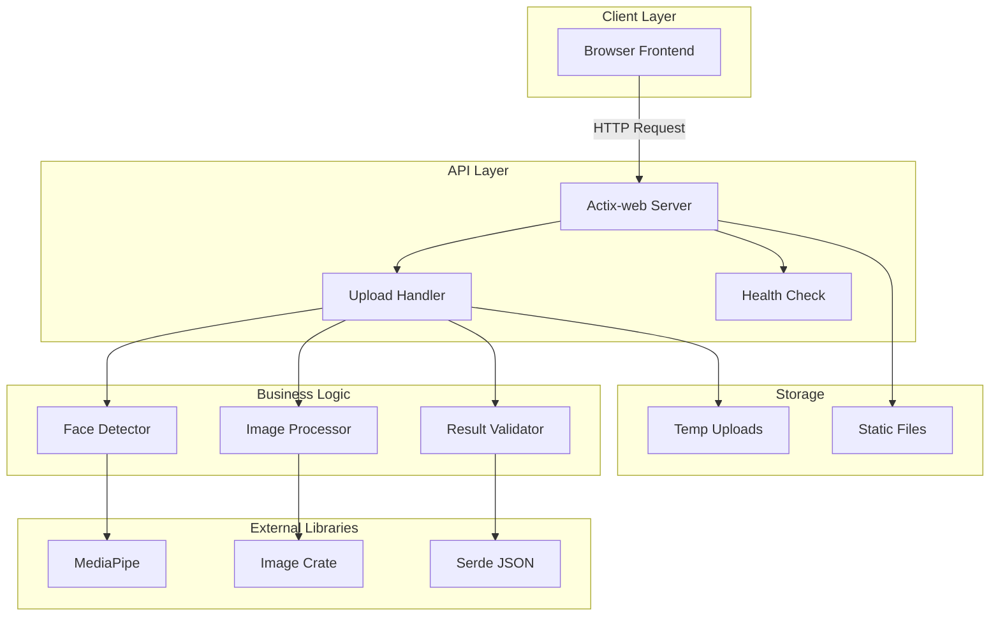
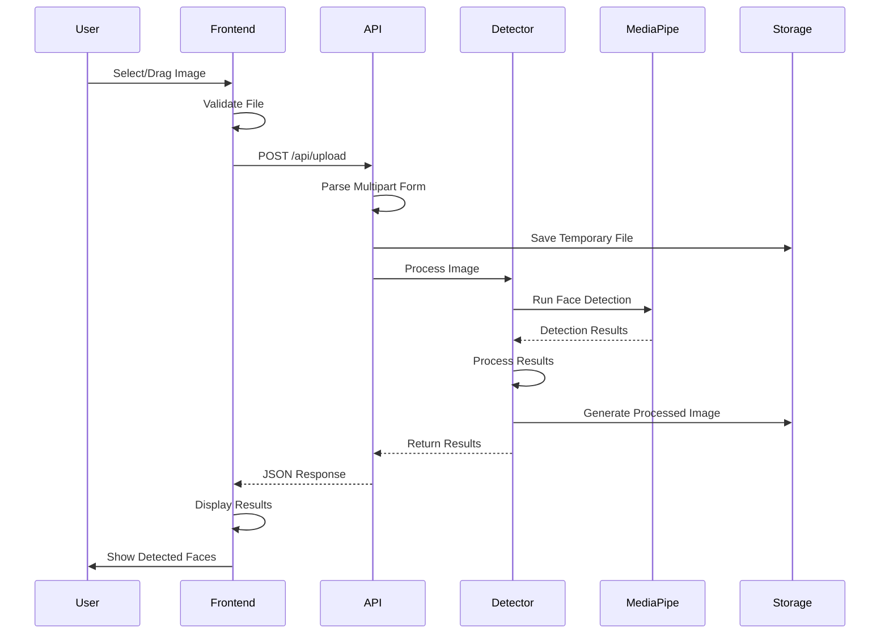

# System Architecture - Face Detection Rust

## High-Level Architecture



## Detailed Flow Diagram

### Upload and Detection Flow


## Component Architecture

### Backend Components

#### 1. API Layer
```rust
// src/api/upload.rs
pub struct UploadHandler {
    detector: FaceDetector,
    validator: FileValidator,
}

impl UploadHandler {
    pub async fn handle_upload(&self, mut payload: Multipart) -> Result<HttpResponse, ApiError> {
        // Implementation
    }
}
```

#### 2. Detection Service
```rust
// src/detection/detector.rs
pub struct FaceDetector {
    pipeline: MediaPipePipeline,
    config: DetectionConfig,
}

impl FaceDetector {
    pub fn detect_faces(&self, image_path: &Path) -> Result<Vec<FaceDetection>, DetectionError> {
        // Implementation
    }
}
```

#### 3. Image Processing
```rust
// src/utils/image.rs
pub struct ImageProcessor {
    max_size: (u32, u32),
    quality: u8,
}

impl ImageProcessor {
    pub fn process_for_detection(&self, image: DynamicImage) -> Result<ProcessedImage, ImageError> {
        // Implementation
    }
    
    pub fn draw_bounding_boxes(&self, image: &DynamicImage, faces: &[FaceDetection]) -> Result<DynamicImage, ImageError> {
        // Implementation
    }
}
```

## Data Flow Architecture

### Request Flow
1. **Client Upload**: User uploads image via web interface
2. **Validation**: File type, size, and format validation
3. **Storage**: Temporary storage of uploaded file
4. **Processing**: Image processing and face detection
5. **Analysis**: Detection results analysis and formatting
6. **Response**: JSON response with detection results
7. **Display**: Frontend displays results with visual overlay

### Response Structure
```json
{
  "success": true,
  "data": {
    "original_image": "base64_string",
    "processed_image": "base64_string_with_boxes",
    "detection_summary": {
      "total_faces": 3,
      "processing_time_ms": 150,
      "confidence_threshold": 0.5
    },
    "faces": [
      {
        "id": 1,
        "bounding_box": {
          "x": 100,
          "y": 150,
          "width": 80,
          "height": 80
        },
        "confidence": 0.95,
        "landmarks": {
          "left_eye": {"x": 120, "y": 170},
          "right_eye": {"x": 150, "y": 170},
          "nose": {"x": 135, "y": 185},
          "mouth": {"x": 135, "y": 200}
        }
      }
    ]
  },
  "metadata": {
    "timestamp": "2024-01-01T00:00:00Z",
    "version": "1.0.0"
  }
}
```

## Security Architecture

### Input Validation
```rust
pub struct ValidationService {
    max_file_size: usize,
    allowed_types: Vec<String>,
}

impl ValidationService {
    pub fn validate_upload(&self, file: &FileUpload) -> Result<(), ValidationError> {
        // Check file size
        // Check file type
        // Check file content
        // Validate image format
    }
}
```

### Security Measures
1. **File Type Validation**: Whitelist allowed formats
2. **File Size Limits**: Prevent DoS attacks
3. **Content Validation**: Verify actual image content
4. **Rate Limiting**: Prevent abuse
5. **CORS Configuration**: Proper CORS headers
6. **Error Sanitization**: Don't expose internal errors

## Performance Architecture

### Optimization Strategies
1. **Async Processing**: Non-blocking I/O operations
2. **Image Resizing**: Process smaller images for speed
3. **Caching**: Cache detection results
4. **Connection Pooling**: Efficient resource usage
5. **Load Balancing**: Scale horizontally

### Resource Management
```rust
pub struct ResourceManager {
    max_concurrent_processes: usize,
    process_timeout: Duration,
    memory_limit: usize,
}

impl ResourceManager {
    pub async fn process_with_limits(&self, image: Image) -> Result<DetectionResult, ResourceError> {
        // Implement timeout
        // Monitor memory usage
        // Limit concurrent processes
    }
}
```

## Error Handling Architecture

### Error Types
```rust
#[derive(Debug, thiserror::Error)]
pub enum ApiError {
    #[error("Invalid file format")]
    InvalidFileFormat,
    
    #[error("File too large")]
    FileTooLarge,
    
    #[error("Detection failed")]
    DetectionFailed,
    
    #[error("Internal server error")]
    InternalError,
}

impl ResponseError for ApiError {
    fn error_response(&self) -> HttpResponse {
        match self {
            // Map to appropriate HTTP status codes
        }
    }
}
```

### Error Recovery
1. **Graceful Degradation**: Continue operation with reduced functionality
2. **Retry Logic**: Automatic retry for transient failures
3. **Fallback Mechanisms**: Alternative approaches
4. **User Feedback**: Clear error messages

## Monitoring & Logging

### Logging Strategy
```rust
use tracing::{info, warn, error};

pub fn log_detection_result(result: &DetectionResult) {
    info!("Detection completed: {} faces found", result.faces.len());
    
    if result.faces.is_empty() {
        warn!("No faces detected in image");
    }
    
    for face in &result.faces {
        info!("Face detected: confidence={}", face.confidence);
    }
}
```

### Metrics Collection
- Request count and latency
- Detection success rate
- Error rates by type
- Resource usage statistics
- Performance metrics

## Deployment Architecture

### Docker Configuration
```dockerfile
FROM rust:1.70 as builder
WORKDIR /app
COPY Cargo.toml Cargo.lock ./
COPY src ./src
RUN cargo build --release

FROM debian:bullseye-slim
RUN apt-get update && apt-get install -y \
    libopencv-dev \
    && rm -rf /var/lib/apt/lists/*
COPY --from=builder /app/target/release/face-detect-rust /usr/local/bin/
COPY static ./static
EXPOSE 8080
CMD ["face-detect-rust"]
```

### Environment Configuration
```bash
# Development
RUST_LOG=debug
PORT=8080
MAX_FILE_SIZE=5242880
DETECTION_THRESHOLD=0.5

# Production
RUST_LOG=info
PORT=80
MAX_FILE_SIZE=10485760
DETECTION_THRESHOLD=0.7
```

## Scalability Considerations

### Horizontal Scaling
1. **Stateless Design**: No server-side session state
2. **Load Balancing**: Distribute requests across instances
3. **Shared Storage**: Centralized file storage
4. **Caching Layer**: Redis for result caching

### Vertical Scaling
1. **Resource Optimization**: Efficient memory usage
2. **CPU Utilization**: Multi-threaded processing
3. **I/O Optimization**: Async file operations
4. **Network Efficiency**: Compressed responses